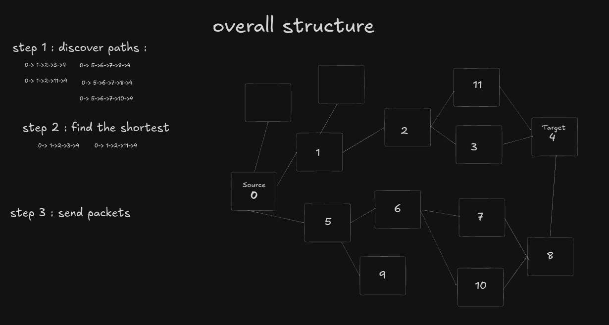
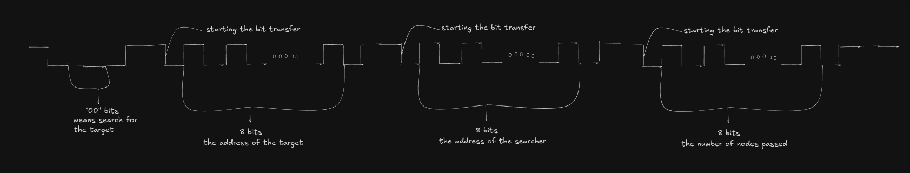
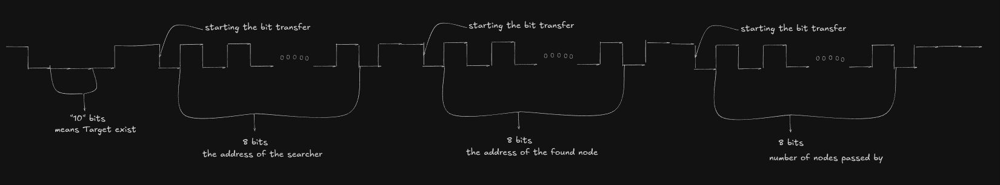
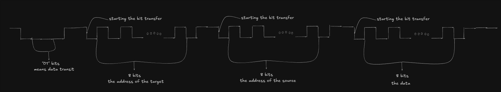
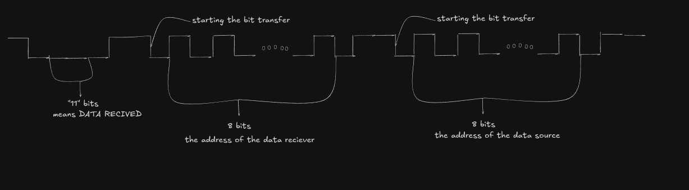

# my-communication-protocol



- a mesh communication protocol
- where every node is connected to other nodes (up to 4)
- every node has its own address
- each node can communicate with any other node in the network

# general structure

- to implement the ideas above, I decided to make 4 types of packets
- each packet has 3 or 4 parts
- first 2 bits for the mode (what the node is doing by sending this request, like is it searching for another node or sending 8-bit data)
- second 8 bits are for the address, the address for the target
- the third 8 bits are for the sender address, i.e. what node is searching
- and the last 8 bits are for data, or for information about the packet like how many nodes have been passed by this packet

## SEARCHING MODE



- this is the searching mode (00 as the code)
- then the address of the target
- then the address of the searcher
- then the number of nodes passed by
- whenever this packet passes by a node, it broadcasts this searching packet to every line attached (except the source, of course) and the firmware saves the path for the source node so it does not need to search for it again next time

## TARGET EXISTS



- this comes when the searching packet reaches the target
- the target of the search sends this packet to the source to confirm its existence
- the code for this mode is 10
- the first address is for the source (who sent the search request)
- the second is for the search target
- the last 8 bits are for how many nodes got passed by

## DATA_TRANSIT



- this is where the data gets shared
- the code for this, as shown in the picture, is 01
- the first address is for the target address
- the second is for the source address
- the last 8 bits are for the data

## DATA_RECEIVED



- this is when the data receiver has received the data packet (code 11)
- it only contains 3 parts
- one for the mode
- the first address is for the data receiver
- the second is for the data source

# firmware structure

- as you have seen, the bit reading is edge-triggered: each node's MCU pins 1, 2, 3, 4 on GPIOB are connected to an external interrupt that fires on a rising or falling edge. The ISR redirects the MCU to the bit-reading function that corresponds to that pin. The context switch happens via a PendSV handler.
- each communication line (GPIO pin) has its own set of parameters:

```c
typedef struct {
    communication_line_rx_param_t *params_rx;
    communication_line_tx_param_t *params_tx;
    thread_t *communication_thread;
    void (*writing_func)(void *);
} communication_line_t;
```

- we have params for rx linked with GPIOB:

```c
typedef struct {
    uint8_t scratch_buffer;
    uint8_t mode_buffer;
    uint8_t finished_reading_mode;

    uint8_t data_buffer;
    uint8_t finished_reading_data;

    uint8_t address_buffer;
    uint8_t finished_reading_address;

    uint8_t address2_buffer;
    uint8_t finished_reading_address2;

    uint8_t pin;
    uint8_t recieved_bits;
    uint8_t sent_bits;
    int32_t last_falling_edge;
    int32_t last_rising_edge;
    last_edge_t last_edge;
    reading_t r;
    modes_t mode;

    void (*recived_data_intr)(void *);
    void *recived_data_intr_params;

    void (*data_handshake_intr)(void *);
    void *data_handshake_intr_params;

    void (*existing_target_intr)(void *);
    void *existing_target_intr_params;
} communication_line_rx_param_t;
```

- this keeps track of the state of the communication line, like `address_buffer`, `address2_buffer`, `data_buffer`, and `mode`, and it keeps track of the last edge's timing and type (rising or falling)
- the reading happens edge to edge, and each line has its own thread
- but for sending the packet, it happens in one blocking loop (not a big loop though) — I want to improve this in the future by making it happen on every timer tick instead
```c
    typedef struct {
  uint8_t data_buffer;
  uint8_t address_buffer;
  uint8_t address2_buffer;
  uint8_t pin;
  uint8_t sent_bits;
  int32_t last_write_tick;
  sending_t s;
  modes_t s_mode;
} communication_line_tx_param_t;
```
- this keeps track of the tx state

## Hardware notes

- bit width is decided by the timer count in TIM2; each timer tick is 1 ms
- every line has to be pulled up to 3.3V

## Importante Note
- this firemware is not fairly tested cause I don't have the compatible hardware, I'll be very happy if someone tested it separatly and sent me his notes 